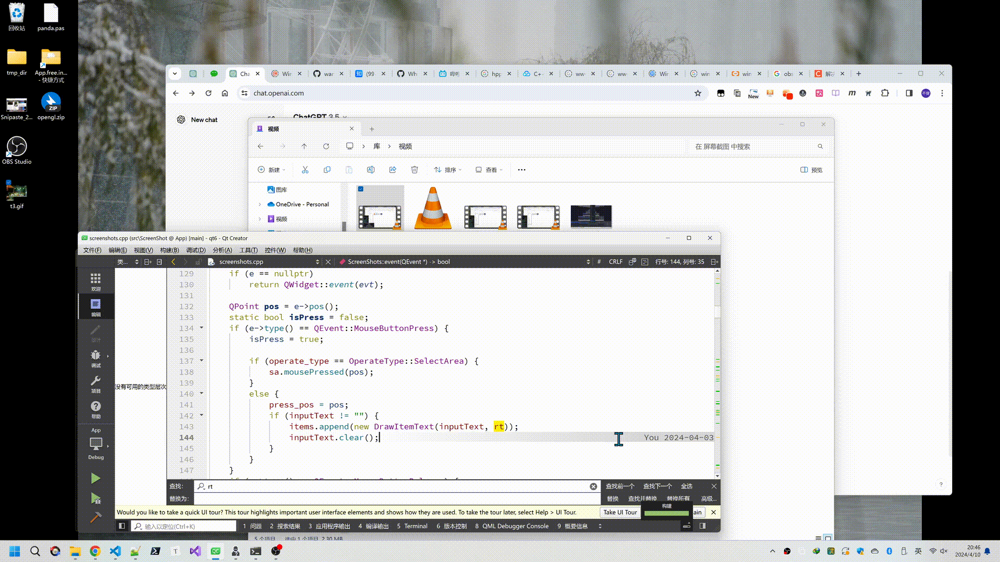

## 项目链接

### 主要项目

| 名称 | 说明 |
|---|---|
| [App](https://github.com/wang9527s/App)  | 笔记  |
| [note.dir](https://github.com/wang9527s/note.dir)  | 笔记  |
| [wtools](https://github.com/wang9527s/wtools)|  之前的工具软件，待合入App中|
|  [wbash](https://github.com/wang9527s/wbash) | 常用linux脚本  |
|  [raw-image-viewer](https://github.com/wang9527s/raw-image-viewer) |  raw图片显示器 |
| [paddle-ocr-study](https://github.com/wang9527s/paddle-ocr-study)  |   paddle ocr 的 demo|

  

[全部仓库](./01.全部项目说明.md)